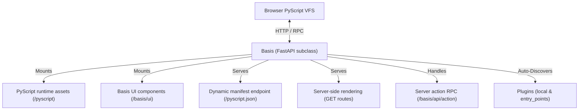

# The Basis App

The `Basis` class is the central object in every Basis application. It inherits from `FastAPI` (and includes `DBAppMixin`), making it a fully ASGI-compatible web application that accepts standard FastAPI routes, middleware, and dependency injection alongside Basis-specific APIs.

---

## Architecture Overview



---

## App Initialization

```python
from basis import Basis

app = Basis(
    pyc_mode=False,
    plugins_dir="plugins",
    plugins=True,
    exclude_plugins=None,
)
```

### Initialization Parameters

| Parameter | Type | Default | Description |
| :--- | :--- | :--- | :--- |
| `pyc_mode` | `bool` | `False` | When `True` (or when `BASIS_PYC_MODE=1` is set in environment), enables on-the-fly PYC bytecode compilation for served Python files. |
| `plugins_dir` | `str` | `"plugins"` | Directory path relative to the app where local plugins reside. |
| `plugins` | `bool \| list[str]` | `True` | Controls plugin discovery. `True` discovers all; `["name1"]` allows specific plugins; `False` disables installed-plugin discovery. |
| `exclude_plugins` | `list[str]` | `None` | Optional list of plugin names to exclude from loading. |

---

## Standard FastAPI Compatibility

Because `Basis` inherits from `FastAPI`, standard routes, dependencies, and middleware work out-of-the-box:

```python
from basis import Basis

app = Basis()

@app.get("/api/health")
def health_check():
    return {"status": "ok"}
```

---

## Core Framework APIs

### `@app.entrypoint`

The simplest way to configure a single-page Basis app. Decorating your root component class:

- Calls `app.bootstrap()` to initialize framework infrastructure.
- Registers a GET route at `/` that server-renders the decorated component.
- Detects the component module file and mounts its parent directory so PyScript can fetch dependencies.

```python
@app.entrypoint
class MyApp(Component):
    ...
```

---

### `app.bootstrap()`

Initializes framework-level assets and endpoints in a single call:

1. **Offline PyScript**: Mounts PyScript WebAssembly assets at `/pyscript`.
2. **Manifest**: Registers `/pyscript.json` providing PyScript with the VFS file map and client module declarations.
3. **Runtime Libraries**: Mounts `basis.client` and `basis.shared`.
4. **UI Components**: Mounts the `basis.ui` component library at `/basis/ui/`.
5. **RPC Endpoint**: Registers `/basis/api/action` for global server actions and `/basis/api/plugin-action` for plugin actions.
6. **Plugin Auto-Discovery**: Scans `plugins/` directory and `basis.plugins` entry points.

---

### `app.include_plugin(plugin)`

Explicitly registers a `BasisPlugin` instance with the application:

```python
from my_feature import plugin as my_plugin

app.include_plugin(my_plugin)
```

This mounts the plugin's APIRouter under its declared `prefix`, registers static component files if present, and invokes the plugin's `on_register` lifecycle hook.

---

### `app.include_components_dir(mount_path, dir_path, name)`

Serves a directory of components to both the server SSR renderer and the client's PyScript runtime:

```python
app.include_components_dir(
    mount_path="/components",
    dir_path="./components",
    name="my_components",
)
```

---

### `app.include_ssr_page(path, component_cls, ...)`

Registers a GET route that server-renders a specific component:

```python
app.include_ssr_page(
    "/profile",
    ProfileComponent,
    title="User Profile",
    page_cls=MyCustomPage,  # optional custom Page shell
)
```

---

## Per-Request State Isolation

Basis incorporates HTTP middleware (`clear_basis_registries_middleware`) that automatically resets internal runtime registries (component instances, pending subscriptions, route tables) at the start of each request. This prevents state leakage across server-rendered requests and avoids ORM detached-instance errors.

---

## Lifespan Lifecycle Integration

The Basis application manages an async lifespan context manager during server start and shutdown:
1. Calls `app.bootstrap()` and precomputes the PyScript VFS registry.
2. Triggers `on_startup(app)` for all registered plugins.
3. On shutdown, triggers `on_shutdown(app)` for registered plugins in reverse order.
