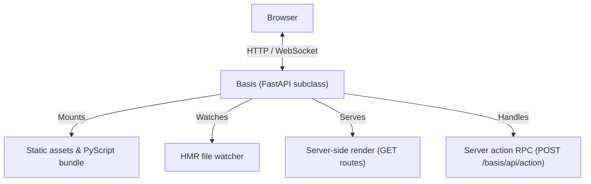

# The Basis App

The `Basis` class is the central object in every Basis application. It inherits from FastAPI, which means it is a fully ASGI-compatible web application that accepts standard FastAPI routes, middleware, and dependency injection alongside Basis-specific APIs.

---

## Architecture overview



---

## Standard FastAPI compatibility

Because `Basis` inherits from `FastAPI`, you can mix standard routes with reactive components freely:

```python
from basis.shared.component import Basis

app = Basis()

@app.get("/api/health")
def health_check():
    return {"status": "ok"}
```

---

## Core APIs

### `@app.entrypoint`

The simplest way to configure a Basis app. Used as a decorator on your root component class, it:

- Calls `app.bootstrap()` to set up framework assets (PyScript, framework files, server actions endpoint).
- Registers a GET route at `/` that server-renders the decorated component.
- Detects the file that defines the component and mounts its parent directory so PyScript can fetch the source.

```python
@app.entrypoint
class MyApp(Component):
    ...
```

`@app.entrypoint` can also accept optional arguments:

```python
@app.entrypoint(pyscript_src="https://pyscript.net/releases/2026.3.1")
class MyApp(Component):
    ...
```

---

### `app.bootstrap()`

Initializes all framework-level infrastructure in one call:

1. Mounts the offline PyScript bundle at `/pyscript`.
2. Registers the `/pyscript.json` manifest endpoint that tells PyScript which files to fetch.
3. Mounts the `basis.client` and `basis.shared` runtime libraries.
4. Mounts the built-in UI component library.
5. Registers the server actions RPC endpoint at `/basis/api/action`.

`@app.entrypoint` calls this automatically. You only need to call it manually if you're building the app setup yourself using `include_ssr_page()`.

---

### `app.include_components_dir(mount_path, dir_path, name)`

Serves a directory of components to both the server SSR renderer and the browser's PyScript runtime:

```python
app.include_components_dir(
    mount_path="/components",
    dir_path="./components",
    name="my_components",
)
```

This mounts the directory as a static file server and registers it with the `/pyscript.json` manifest so PyScript can import your component modules.

---

### `app.include_ssr_page(path, component_cls, ...)`

Registers a GET route that server-renders a specific component:

```python
app.include_ssr_page(
    "/profile",
    ProfileComponent,
    title="User Profile",
    page_cls=MyCustomPage,  # optional; defaults to Page
)
```

Use this when you need multiple SSR routes, or when you want to attach a custom `Page` subclass to control the HTML shell.

---

## Hot Module Replacement

Basis ships a built-in HMR development server. To use it, run your app with `run_with_hmr()` instead of plain `uvicorn`:

```python
if __name__ == "__main__":
    app.run_with_hmr(port=8000)
```

Internally, `run_with_hmr()` registers an ASGI startup event that launches an async file watcher task. That task polls all registered component directories for changes to `.py`, `.html`, and `.css` files every 500ms. When a change is detected, it broadcasts the new file content over the `/ws/hmr` WebSocket connection to all connected browsers.

The browser client receives the payload, re-evaluates the updated module, and re-renders any active component instances — preserving current state where possible.
