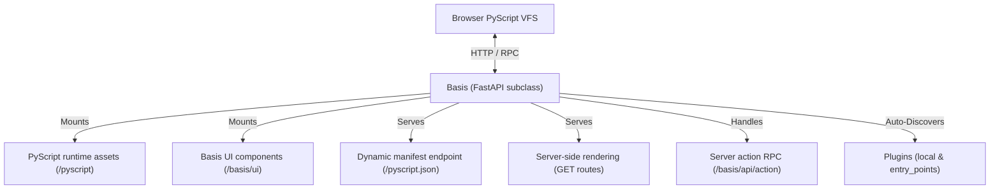

# The Basis App

The `Basis` class is the central object in every Basis application. It inherits from `FastAPI` (and includes `DBAppMixin`), making it a fully ASGI-compatible web application that accepts standard FastAPI routes, middleware, and dependency injection alongside Basis-specific APIs.

---

## Architecture Overview



---

## App Initialization

```python
from basis import Basis

app = Basis(
    pyc_mode=False,
    components_dir="components",
    stores_dir="stores",
    plugins_dir="plugins",
    plugins=True,
    exclude_plugins=None,
)
```

### Initialization Parameters

| Parameter | Type | Default | Description |
| :--- | :--- | :--- | :--- |
| `pyc_mode` | `bool` | `False` | When `True` (or when `BASIS_PYC_MODE=1` is set in environment), enables on-the-fly PYC bytecode compilation for served Python files. |
| `components_dir` | `str` | `"components"` | Conventional auto-discovered component directory name (relative to the app directory). Must be a package (has `__init__.py`). |
| `stores_dir` | `str` | `"stores"` | Conventional auto-discovered stores directory name (relative to the app directory). Must be a package; modules are imported so their module-scope store instances register. |
| `plugins_dir` | `str` | `"plugins"` | Directory path relative to the app where local plugins reside. |
| `plugins` | `bool \| list[str] \| None` | `None` | Controls plugin discovery. `None` (the default) and `True` both discover all installed plugins; `["name1"]` restricts to specific plugins (allowlist); `False` disables installed-plugin discovery. Local `plugins/` scanning always runs. |
| `exclude_plugins` | `list[str]` | `None` | Optional list of plugin names to exclude from loading. |

---

## Standard FastAPI Compatibility

Because `Basis` inherits from `FastAPI`, standard routes, dependencies, and middleware work out-of-the-box:

```python
from basis import Basis

app = Basis()

@app.get("/api/health")
def health_check():
    return {"status": "ok"}
```

---

## Core Framework APIs

### `@app.page(path="/")`

The simplest way to expose a root component as a page. Decorating your root component class:

- Calls `app.bootstrap()` to initialize framework infrastructure (including conventional `components/`, `stores/`, `plugins/` auto-discovery).
- Registers a GET route at `path` (default `/`) that server-renders the decorated component.
- Serves the component's code **isomorphically**: if the component already lives inside a discovered `components/` package, it is served from that package-derived mount (no automatic `/` mount, so the VFS name equals the filesystem name); only a bare single-file app falls back to mounting its directory at `/`. See [Importing Components & the Isomorphism Principle](../04_components/importing-components.md).

`@app.page` decorates a **root component** (a `Component` subclass) — never a `Page`. It is the "quick and dirty" path: **page-level `stores` are not supported here** (the client boots from the component file, so it cannot hydrate page stores). To declare page stores, write a `Page` subclass and register it with `@app.include_page(path)` or `app.include_page(path, page_cls=MyPage)`.

> [!NOTE]
> `@app.page` configures PyScript to load from the **online** CDN (`https://pyscript.net/releases/2026.3.1`) by default. Pass `pyscript_src="/pyscript"` to use the offline bundle that `bootstrap()` mounts instead. See [The Page Component](../04_components/page-component.md) for details.

```python
@app.page(path="/")
class MyApp(Component):
    ...
```

---

### `app.bootstrap()`

Initializes framework-level assets and endpoints in a single call:

1. **Offline PyScript**: Mounts PyScript WebAssembly assets at `/pyscript`.
2. **Manifest**: Registers `/pyscript.json` providing PyScript with the VFS file map and client module declarations.
3. **Runtime Libraries**: Mounts `basis.client` and `basis.shared`.
4. **UI Components**: The built-in UI component suite ships as the official `ui` plugin (`basis.plugins.ui`) and is served to the client at `/basis/plugins/ui` when the plugin auto-registers (step 7).
5. **RPC Endpoint**: Registers `/basis/api/action` — the single endpoint dispatching both `@server_action` and `@plugin.action` by their canonical `module.qualname` path.
6. **Conventional Directory Auto-Discovery**: mounts `components/` and `stores/` at their package paths (isomorphic VFS namespace) and imports `stores/` modules so their module-scope store instances register.
7. **Plugin Auto-Discovery**: Scans `plugins/` directory and `basis.plugins` entry points.

---

### `app.include_plugin(plugin)`

Explicitly registers a `BasisPlugin` instance with the application:

```python
from my_feature import plugin as my_plugin

app.include_plugin(my_plugin)
```

This mounts the plugin's APIRouter under its declared `prefix`, registers static component files if present, and invokes the plugin's `on_register` lifecycle hook.

---

### `app.include_components_dir(mount_path, dir_path, name)`

Serves a directory of components to both the server SSR renderer and the client's PyScript runtime:

```python
app.include_components_dir(
    mount_path="/components",
    dir_path="./components",
    name="my_components",
)
```

---

### `app.include_page(path, *, page_cls=MyPage)`

Registers a GET route that server-renders a `Page`. The Page is a complete recipe — `root_component`, `stores`, `title`, and PyScript config all live on the class. Usable as a method or as a decorator on a Page subclass:

```python
app.include_page("/admin", page_cls=MyAdminPage)

# or as a decorator
@app.include_page("/admin")
class AdminPage(Page):
    root_component = Admin
    stores = ["app_state", "router"]   # store names, instantiated in stores/
```

---

## Per-Request State Isolation

Basis incorporates HTTP middleware (`clear_basis_registries_middleware`) that automatically resets internal runtime registries (component instances, pending subscriptions, route tables) at the start of each request. This prevents state leakage across server-rendered requests and avoids ORM detached-instance errors.

---

## Lifespan Lifecycle Integration

The Basis application manages an async lifespan context manager during server start and shutdown:
1. Calls `app.bootstrap()` and precomputes the PyScript VFS registry.
2. Triggers `on_startup(app)` for all registered plugins.
3. On shutdown, triggers `on_shutdown(app)` for registered plugins in reverse order.
