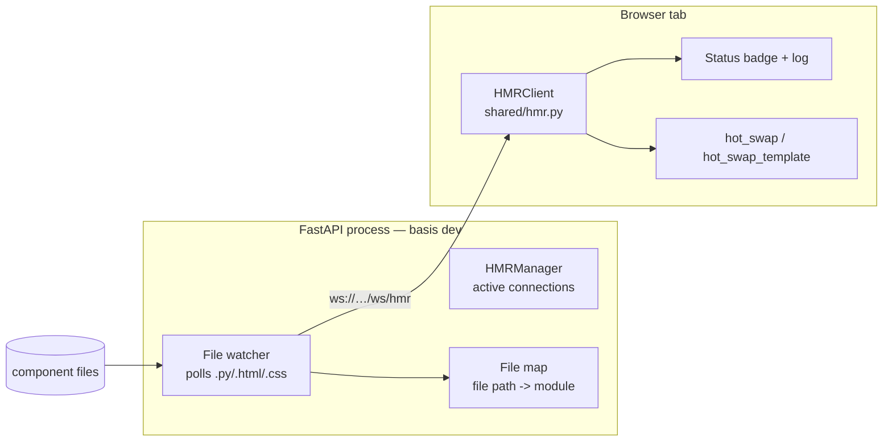

# Hot Module Replacement (HMR)

Basis ships with built-in Hot Module Replacement (HMR) for development. Edit a component file and the open browser tab updates **live** — no manual refresh, no full page reload, no lost state. `.py`, `.html`, and `.css` changes are all hot-swapped while `basis dev` is running.

This chapter explains how the current implementation works end to end.

## The idea

A full page reload re-downloads the Pyodide WASM runtime, reboots the interpreter, and destroys all client-side state. HMR avoids all of that:

1. The dev server detects a file change **without restarting** the process.
2. The new content is pushed to the browser over a WebSocket.
3. The browser updates **only** the affected components, preserving instance state.

HMR is enabled by default in `basis dev`, so it "just works" from the first run.

## End-to-end flow

```text
1. You edit components/titlebar/titlebar.css
2. The server file watcher (0.5s poll) notices the mtime change
3. The server reads the file and broadcasts over /ws/hmr
      { type, file, ext, module, content }
4. The browser HMRClient dispatches by extension:
      .css  -> patch the owning component's <style> element
      .html -> rebuild the component's template and re-render instances
      .py   -> write to the VFS, re-import the module, hot-swap instances
5. The status badge logs the result
```

## Architecture



| Part | Where | Responsibility |
|------|-------|----------------|
| **File watcher + WebSocket** | `src/basis/server/app.py` | Polls component directories, broadcasts changes with the owning module name. |
| **HMR client** | `src/basis/shared/hmr.py` | Receives updates; live-swaps CSS / HTML / Python. |
| **Instance hot-swap** | `src/basis/shared/base_component.py` | Re-renders live instances from a new (or template-refreshed) class, preserving state. |

---

## Server side

### Enabling HMR

```console
$ basis dev            # HMR on (default)
$ basis dev --no-hmr   # disable the live watcher
$ basis dev --reload   # full-process uvicorn reload instead (server-only code)
```

`--hmr` (the default) launches uvicorn **without** `--reload` and sets the `BASIS_HMR=1` environment variable. `Basis.__init__` reads it:

```python
self._start_hmr_watcher = os.environ.get("BASIS_HMR", "").lower() in ("1", "true", "yes")
```

At startup, the ASGI lifespan starts a background task running the file watcher:

```python
if app._start_hmr_watcher:
    watcher_task = asyncio.create_task(app._start_file_watcher())
```

`--reload` and `--hmr` are mutually exclusive: `--reload` restarts the whole process on any `.py` change (which would pre-empt and race the in-process watcher). HMR handles component files; `--reload` is for server-only code.

### The file watcher

`_start_file_watcher()` polls every **0.5s**. For each mounted component directory it walks `.py`, `.html`, and `.css` files (skipping `__pycache__`), tracks mtimes, and when a file changes it reads the new content and broadcasts:

```json
{
  "type": "hmr",
  "file": "titlebar/titlebar.css",        // path relative to the component dir
  "ext": "css",
  "module": "jotter.components.titlebar", // owning component's import name
  "content": ".titlebar { height: 48px; }"
}
```

### The `/ws/hmr` WebSocket

Registered once in `Basis.__init__`, so it is always available regardless of how many component directories are mounted:

```python
@self.websocket("/ws/hmr")
async def hmr_websocket_endpoint(websocket: WebSocket):
    await self.hmr_manager.connect(websocket)
    try:
        while True:
            await websocket.receive_text()  # keep alive
    except WebSocketDisconnect:
        self.hmr_manager.disconnect(websocket)
```

`HMRManager` keeps the set of connected clients; `broadcast()` sends the JSON message to each and evicts dead sockets.

### Resolving the owning module

Every broadcast carries the **authoritative import module name** of the component the file belongs to. `_build_hmr_file_map()` computes it with the same convention the VFS manifest uses (`initialize_pyscript_registry`):

```text
mount_parts + subdir + module_stem      (a trailing "__init__" is dropped)

e.g. mount "/jotter/components/" + "statusbar.py"
   -> ["jotter", "components", "statusbar"] -> "jotter.components.statusbar"
```

This covers every watched file:

- `.py` files map to their own module (e.g. `jotter.components.statusbar`).
- `.css` / `.html` **companion files** map to the module that loads them: a package `titlebar/__init__.py` owns `titlebar/titlebar.css` and `titlebar/titlebar.html`; a flat `my_comp.py` owns `my_comp.css` and `my_comp.html`.

The browser uses this value to find the registered component class by `__module__`, so a file is always attached to the right component even when its filename doesn't resemble the class name (e.g. `titlebar.css` → class `TitleBar`).

---

## Client side

### Connecting

`start_hmr()` is called once from the client entrypoints (`entrypoint_csr.py`, `entrypoint_ssr.py`) and is idempotent — a module-level singleton, so there is exactly one WebSocket per page.

The client opens the socket with `window.WebSocket.new(url)` and keeps `ffi.create_proxy` callbacks alive for the connection's lifetime:

```python
self._on_message_proxy = ffi.create_proxy(self._on_message)
self.ws.onmessage = self._on_message_proxy
```

The URL uses `wss://` automatically when the page is served over HTTPS. A status pill (`#basis-hmr-badge`) and a full-text log (`#basis-hmr-log`) are injected into the page for feedback.

### Dispatch

The client dispatches on the file extension:

```python
if ext == "css":
    self._update_css(file, content, component_class, module)
elif ext == "py":
    self._update_python(file, content, module)
elif ext == "html":
    self._update_html(file, content, component_class, module)
```

---

## How each file type is handled

Content is always **pushed over the WebSocket** — no file is re-fetched over HTTP. Only `.py` changes touch the client VFS, because only modules need to be re-executed from fresh source.

### `.css` — patch the live stylesheet

1. Resolve the owning component class by `module` (or fall back to the filename heuristic / explicit class name).
2. Set `cls.style = content` and re-derive the scoped string via `cls._get_style_string()`, so `@scope`-wrapped styles stay scoped.
3. Update every mounted `<style data-component-class="…">` for that class — from `BaseComponent._style_elements` (a registry filled by `mount_app` that works inside shadow roots) **and** from a light-DOM scan, so the visible stylesheet always reflects the change.
4. If the component isn't mounted, fall back to a global `<style id="basis-hmr-global-css">` appended to `<body>`.

The class object and the `.py` module are untouched; only the stylesheet text changes. No re-render is needed.

### `.html` — rebuild the template and re-render

1. Resolve the owning component class.
2. Set `cls.__templatestr__ = content`.
3. Clear `cls.__binding_blueprints__` and re-run `_initialize_blueprint()`, `_analyze_creation_args()`, and `_analyze_template()` so the binding blueprints are rebuilt from the new markup (they are replaced, never accumulated).
4. Hot-swap every live instance: existing bindings are removed, the DAG is reset, and each instance re-renders from the new blueprint with its state restored.

### `.py` — re-import the module and hot-swap

The deepest path, because a module's behavior lives in its code object:

1. **Resolve the module** by the server-provided name.
   - Not in `sys.modules` → skip (applies on the next full reload).
   - Loaded from `.pyc`/`.pyo` (PYC mode) → skip with a notice; compiled bytecode can't be live-reloaded.
2. **Write the new source to the Pyodide VFS** at the module's real path (`module.__file__`, e.g. `/home/pyodide/jotter/components/statusbar.py`).
3. **`importlib.invalidate_caches()`**, so a fresh import re-reads the file instead of a cached directory listing.
4. **Evict** the module (and any `module.*` submodules) from `sys.modules`.
5. **Re-import** with `importlib.import_module(module)`. On failure, the old module reference is restored so the app keeps working.
6. **Hot-swap** every component class that has live instances.

> **Why evict + re-import rather than `importlib.reload`?** `reload()` re-executes a module's *existing* code object — it never re-reads the source from disk. Only a fresh import (after writing the VFS file and clearing the import cache) picks up the new source.

---

## Instance hot-swap

`BaseComponent.hot_swap(new_cls)` re-renders a live instance from a (possibly new) class while preserving state:

```text
1. _capture_state()          # snapshot plain (non-$/#) field values
2. self.__class__ = new_cls  # adopt the new class
3. _rerender_after_swap()    # rebuild bindings + DOM, restore state
```

`_rerender_after_swap(state)`:

1. Removes the instance's bindings and resets its `DependencyGraph`.
2. Clears the cached `_template` / `_nodes` so the next access clones the (new) blueprint.
3. **Rebinds against the fresh template nodes first, then swaps them into the DOM** — mirroring the normal `initialize()` + `mount()` order. This matters because `replaceWith(fragment)` moves the fragment's children into the DOM and empties the fragment; binding first keeps the bindings attached to the nodes that actually end up on the page.
4. Restores the captured state inside `refrain()` (its `__exit__` triggers the affected DAG nodes) and re-caches a fresh template clone.

### Subclass instances

A live instance may belong to a subclass defined in a *different* module — e.g. `app_container.StatusBar(StatusBar)`. Replacing the class outright would lose the subclass's methods and default attribute values, so HMR distinguishes two cases:

- **Exact-class match** (`type(instance) is old_cls`) → full `hot_swap` to the new class.
- **Subclass match** → `hot_swap_template()`, which keeps the instance's class and only re-points its inherited template to the reloaded base (`_adopt_template()`: adopt `__templatestr__`, rebuild blueprints + blueprint element, then re-render).

Because a subclass's MRO still references the original base class, `HMRClient` records template-refreshed subclasses in a `_refreshed_subclasses` registry (`module -> {subclass_cls: base_name}`) and re-applies them on every subsequent reload of that module, so repeated hot-swaps keep working.

---

## Custom elements

Components with a hyphenated `__tag__` (e.g. `ui-button`) are registered as browser custom elements once per tag (`window.customElements.get(tag)`). On a `.py` re-import the class is re-created, but a custom element cannot be redefined; instead of re-registering, HMR keeps the existing JS class and refreshes a config registry (`globalThis.__basisElementConfigs`) so newly created elements render the updated template.

---

## Dev status feedback

While HMR is active a small pill appears in the bottom-right corner:

- **amber** — connecting
- **green** — connected / last update succeeded (`✓`)
- **red** — disconnected / last update failed (`✗`)

`#basis-hmr-log` keeps a full-text history of updates (module reloaded, instances hot-swapped, errors), so a failed swap is never silent.

---

## Usage & workflow

```console
$ cd myapp
$ basis dev                # HMR on, live-swap .py/.html/.css
$ basis dev --no-hmr       # disable the live watcher
$ basis dev --reload       # full process restarts instead
```

- **Edit a component's `.py`** — the module is re-imported and all live instances hot-swap in place; field values and input contents are preserved.
- **Edit a `.html`** — the template is rebuilt and instances re-render.
- **Edit a `.css`** — the component's `<style>` element updates live.

> **Notes**
> - Only **component files** are hot-swapped. Framework internals (`basis/shared/*`, `basis/client/*`) and server-only modules are served, not watched — edit those with `basis dev --reload`.
> - **PYC mode** (`--pyc`) can't live-reload compiled bytecode; `.py` changes fall back to a full reload with a console notice. Use `--no-pyc` while actively iterating on components.

---

## Design notes

Intentional details worth knowing when extending or debugging HMR:

- **Module names come from the server, not the filename.** The client module namespace (`jotter.components.statusbar`) differs from the file path relative to its mount, and filenames don't reliably encode class names (`titlebar.css` → `TitleBar`). `_build_hmr_file_map()` resolves both `.py` files and their `.css`/`.html` companions to the owning module.
- **Only `.py` writes to the VFS.** CSS and HTML already exist in the browser as in-memory objects (class `style` / `__templatestr__`, blueprints, and mounted `<style>` / DOM nodes), so they're mutated directly. Python must be re-executed from fresh source, which is why it goes through the VFS + re-import.
- **Binding blueprints are replaced, never extended.** Re-analysis clears `__binding_blueprints__` first, so repeated HTML updates don't stack duplicate bindings.
- **Subclass identity is preserved.** `hot_swap_template` keeps the instance's class and refreshes only the inherited template, so component subclasses defined in other modules survive reloads.
- **Styles can live in two places.** The `_style_elements` registry covers shadow-root mounts; the light-DOM scan covers visible stylesheets. Both are updated so a stale copy can't mask the change.

---

*Part of the **Advanced Guide** track. See also [SSR & Client Hydration](../05_reactivity/ssr-hydration.md) and [PYC Bytecode Delivery Mode](pyc-mode.md).*
