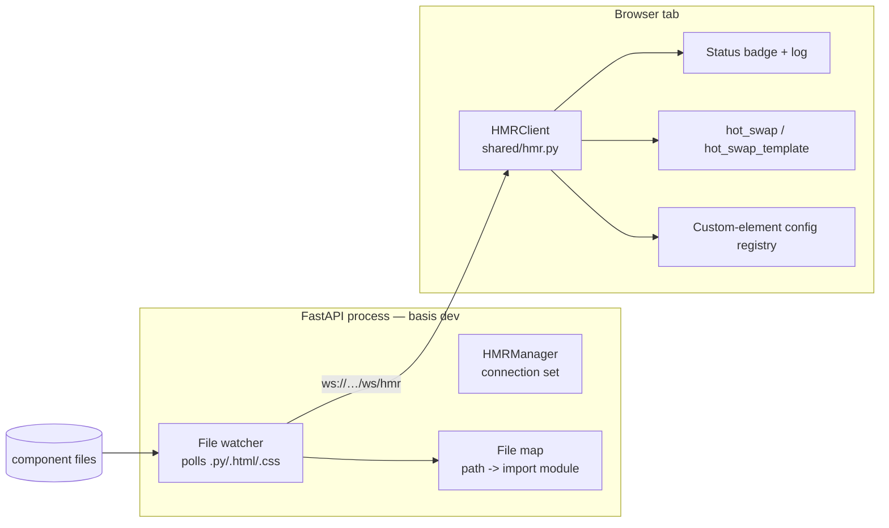

# Hot Module Replacement (HMR)

Basis ships with a first-class development HMR (Hot Module Replacement) system: edit a component file and the open browser tab updates **live** — no manual refresh, no lost state. This chapter is a deep dive into how it works under the hood and how it is implemented, written from the actual (trial-and-error-hardened) implementation.

> **What works today**: `.py` and `.html` changes hot-swap every live instance (CSR and SSR modes, browser-verified). `.css` changes update the owning component's `<style>` element live (including inside shadow roots). A status badge in the bottom-right corner shows connection state and the last applied update.

---

## The philosophy

HMR is part of Basis's "agile, no-refresh" developer story — the same promise behind the no-build, drop-in-and-run approach. Instead of a full page reload (which re-downloads Pyodide WASM, re-boots the interpreter, and destroys all client state), HMR:

1. Detects a file change on the server **without restarting the process**.
2. Pushes the new content to the browser over a WebSocket.
3. Re-imports / re-renders **only** the affected components, preserving instance state.

It is enabled by default in `basis dev`, matching the "beautiful defaults" principle.

---

## Architecture at a glance



Three moving parts:

| Part | Where | Responsibility |
|------|-------|----------------|
| **File watcher + WebSocket** | `src/basis/server/app.py` | Polls component dirs, broadcasts changes with the authoritative client import module name. |
| **HMR client** | `src/basis/shared/hmr.py` | Receives updates, live-swaps CSS / HTML / Python. |
| **Instance hot-swap** | `src/basis/shared/base_component.py` | Re-renders live instances from a new (or template-refreshed) class, preserving state. |

---

## Server side

### Enabling the watcher

`basis dev` defaults to live HMR:

```console
$ basis dev            # HMR on (default)
$ basis dev --no-hmr   # disable the live watcher
$ basis dev --reload   # full-process uvicorn reload instead (for server-only code)
```

`--hmr` (default) sets the `BASIS_HMR=1` environment variable before launching uvicorn **without** `--reload`. The `Basis` app reads it in `__init__`:

```python
self._start_hmr_watcher = os.environ.get("BASIS_HMR", "").lower() in ("1", "true", "yes")
```

During the ASGI lifespan, if `_start_hmr_watcher` is true, a background task runs the file watcher:

```python
if app._start_hmr_watcher:
    watcher_task = asyncio.create_task(app._start_file_watcher())
```

The watcher is cancelled automatically on shutdown.

> **Why not uvicorn `--reload`?** `--reload` restarts the whole process on any `.py` change. Component directories live under `src/`, so every edit would trigger a full restart — pre-empting and racing the live HMR watcher. Hence the two modes are mutually exclusive: HMR for component files, `--reload` for server-only code.

### The `/ws/hmr` WebSocket

The endpoint is registered **once** in `Basis.__init__` (not per component directory — a historical bug created one duplicate route per `include_components_dir` call):

```python
@self.websocket("/ws/hmr")
async def hmr_websocket_endpoint(websocket: WebSocket):
    await self.hmr_manager.connect(websocket)
    try:
        while True:
            await websocket.receive_text()  # keep alive
    except WebSocketDisconnect:
        self.hmr_manager.disconnect(websocket)
```

`HMRManager` keeps a set of active connections; `broadcast()` sends a JSON message to each, evicting dead sockets on failure.

### The file watcher

`_start_file_watcher()` polls every **0.5s**:

- Walks each mounted component directory (from `_component_routes`) for `*.py`, `*.html`, `*.css`, skipping `__pycache__`.
- Tracks file mtimes; when one increases, it reads the new content and broadcasts:

```json
{
  "type": "hmr",
  "file": "statusbar.py",          // relative to the component dir
  "ext": "py",
  "module": "jotter.components.statusbar",  // authoritative import name (.py only)
  "content": "..."
}
```

### The authoritative module name

The single most important correctness fix: the client must know the **exact** import path of the changed module, not a guess. `_build_hmr_file_map()` derives it the same way `initialize_pyscript_registry` does when building the PyScript VFS manifest:

```text
mount_parts + subdir + module_stem      (with a trailing "__init__" popped)

e.g. mount "/jotter/components/" + "statusbar.py"
   -> ["jotter", "components", "statusbar"] -> "jotter.components.statusbar"
```

This guarantees the client reloads the module that actually lives in `sys.modules`. (The original implementation derived `"statusbar"` from the bare filename, so the lookup never matched.)

---

## Client side

### Connection

`start_hmr()` is idempotent (a module-level singleton) and is called **once**, at the end of the client entrypoints (`entrypoint_csr.py`, `entrypoint_ssr.py`). It must *not* be called from `Component.__init_subclass__` (that would open one WebSocket per component class).

The client connects with `window.WebSocket.new(url)` and keeps `ffi.create_proxy` callbacks alive for the connection's lifetime:

```python
self._on_message_proxy = ffi.create_proxy(self._on_message)
self.ws.onmessage = self._on_message_proxy
```

The URL scheme switches to `wss://` when the page is served over HTTPS. A status badge (`#basis-hmr-badge`) and a full-text log (`#basis-hmr-log`) are injected into the page for at-a-glance feedback.

### Dispatch

```python
if ext == "css":
    self._update_css(file, content, component_class)
elif ext == "py":
    self._update_python(file, content, module)
elif ext == "html":
    self._update_html(file, content, component_class)
```

---

## What each file type does

### `.css` — live style update

1. Resolve the owning component class from the filename (PascalCase of the stem, or the `__tag__`), or from the server-provided class.
2. Set `cls.style = content` and re-derive the scoped string via `cls._get_style_string()` (so `@scope`-wrapped styles stay scoped after the swap).
3. Update every mounted `<style>` element for that class from `BaseComponent._style_elements` — a registry filled in `mount_app` so styles **inside shadow roots** are reachable (where `document.querySelectorAll` cannot see them).
4. Fall back to `style[data-component-class="…"]` in the light DOM, then to a global `<style id="basis-hmr-global-css">` if nothing matched.

### `.html` — template rebuild

1. Find the component class.
2. Set `cls.__templatestr__ = content`.
3. **Clear** `cls.__binding_blueprints__`, then re-run `_initialize_blueprint()`, `_analyze_creation_args()`, and `_analyze_template()`. (The original implementation only *extended* the blueprint list, so repeated HTML updates accumulated duplicate bindings.)
4. Hot-swap every live instance.

### `.py` — module re-import + hot-swap

This is the deepest path. In order:

1. **Resolve the module** by the authoritative name from the server.
   - Not in `sys.modules` → skip (it will apply on the next reload).
   - Loaded from `.pyc`/`.pyo` (PYC mode) → skip with a console notice, because compiled bytecode cannot be live-reloaded.
2. **Write the new source to the Pyodide VFS** at the module's real path (`module.__file__`, e.g. `/home/pyodide/jotter/components/statusbar.py`).
3. **`importlib.invalidate_caches()`** — without this, a cached finder/directory listing can serve the stale file on re-import.
4. **Evict** the module (and any `module.*` submodules) from `sys.modules`.
5. **Re-import** `importlib.import_module(module)`. If it fails, the old module reference is restored so the app keeps working.
6. **Hot-swap** every component class `old_cls -> new_cls` that has live instances.

> **Why evict + re-import instead of `importlib.reload`?** `reload()` re-executes the module's *existing code object* — it never re-reads the source from disk. Only a fresh import (after writing the VFS file and clearing the import cache) picks up the new content.

---

## Instance hot-swap (`hot_swap` / `hot_swap_template`)

`BaseComponent.hot_swap(new_cls)` re-renders a live instance from a new class while preserving state:

```text
1. _capture_state()          # snapshot plain (non-$/#) field values
2. self.__class__ = new_cls  # adopt the new class
3. _rerender_after_swap()    # see below
```

`_rerender_after_swap(state)` does the real work:

1. Remove all existing bindings and reset the `DependencyGraph`.
2. Clear the cached `_template` and `_nodes` so the next access clones the new blueprint.
3. **Re-attach bindings first, then swap the DOM**:

```python
self.__init_selfbinding__()      # bind against the FRESH template nodes
self.__init_slot_bindings__()
self.__init_bindings__()
self.__init_fields__()
new_fragment = self.__template__
old_element.replaceWith(new_fragment)   # then move those nodes into the DOM
```

4. Restore the captured state inside `refrain()` (whose `__exit__` triggers the affected DAG nodes), and re-cache `_template` (the fragment was emptied by `replaceWith`).

> **The ordering trap**: `old_element.replaceWith(fragment)` **empties** the cached `_template` fragment as its children move into the DOM. The original code swapped first and rebuilt bindings after, so the rebuild walked an empty fragment and the visible DOM stayed unbound (literal `{placeholders}`). The rule is: **bind against the fresh nodes, then swap them in** — mirroring the normal `initialize()` + `mount()` order.

### Subclass instances

A live instance may belong to a subclass defined in a *different* module — e.g. Jotter's `app_container.StatusBar(StatusBar)`. A full `hot_swap` would set `self.__class__` to the reloaded base and destroy the subclass identity (its extra methods and default attribute values).

Basis handles this with `hot_swap_template()` / `_adopt_template()`:

- The instance's **class is kept**.
- The subclass adopts the reloaded base's template: `sub.__templatestr__ = new_cls.__templatestr__`, blueprints cleared and re-analyzed, blueprint element rebuilt.
- The instance re-renders from the refreshed blueprint.

Because the subclass's MRO still points at the *original* base (not the reloaded one), a plain `isinstance` check stops matching on the second reload. A persistent `HMRClient._refreshed_subclasses` registry (`module -> {subclass_cls: base_name}`) is re-applied on every subsequent reload of that module, so **repeated** hot-swaps keep working (verified: consecutive edits all apply, swap count stays stable).

---

## Custom elements

Components with a `__tag__` containing a hyphen (e.g. `ui-button`) are registered as browser custom elements. Two subtle issues were fixed here:

1. **Ordering bug** — `_register_custom_element` checked `cls.__tag__ not in cls._registry` *after* `_register_component_subclass` had already registered the class, so `ui-*` / custom-tag elements were **never defined** in the browser. It now guards with `window.customElements.get(tag)`.
2. **Re-definition on HMR** — a custom element can only be defined once per tag. On a `.py` re-import, `__init_subclass__` would try to define it again and crash. The fix keeps the existing JS class and refreshes a config registry (`globalThis.__basisElementConfigs`) so new instances render the updated template, instead of redefining.

The JS `component.js` also had a `pyClass` vs `pyClassName` key mismatch in its SSR-hydration detection; that is now consistent.

---

## Dev status feedback

While HMR is active, a small pill appears bottom-right:

- **amber** — connecting
- **green** — connected / last update succeeded (`✓`)
- **red** — disconnected / last update failed (`✗`)

A `#basis-hmr-log` element keeps a full-text history of updates (module reloaded, instances hot-swapped, errors), so a failed swap is never silent.

---

## Usage & workflow

```console
$ cd myapp
$ basis dev                # HMR on, live-swap .py/.html/.css
$ basis dev --no-hmr       # disable the live watcher
$ basis dev --reload       # full process restarts instead
```

- **Edit a component's `.py`** — the module is re-imported and all live instances hot-swap in place. State (field values, input contents) is preserved via the state snapshot.
- **Edit a `.html`** — the template is rebuilt and instances re-render.
- **Edit a `.css`** — the component's `<style>` element updates live.

> **Notes**
> - Only **component files** are hot-swapped. Framework internals (`basis/shared/*`, `basis/client/*`) and server-only modules are served, not watched — edit those with `basis dev --reload`.
> - **PYC mode** (`--pyc`) cannot live-reload compiled bytecode; `.py` changes fall back to a full reload with a console notice. Use `--no-pyc` while actively iterating on components.

---

## Implementation notes (lessons from building it)

These are the concrete gotchas discovered while making HMR actually work in a real browser (Jotter):

- **Pyodide mounts component files under `/home/pyodide/...`.** `module.__file__` is a real in-memory FS path (e.g. `/home/pyodide/jotter/components/statusbar.py`); writing to it and re-importing works, but only if you also `importlib.invalidate_caches()` and evict the module from `sys.modules`.
- **A DocumentFragment is emptied by `appendChild`/`replaceWith`.** Never cache a fragment and re-read it after moving it into the DOM; re-clone the blueprint instead.
- **`isinstance` matches subclasses too.** For HMR, you must decide between "exact-class swap" (`type(instance) is old_cls`) and "subclass template refresh". Clobbering a subclass with `self.__class__ = base` silently loses behavior.
- **Blueprint lists accumulate.** Re-running `_analyze_template()` on an existing class *extends* `__binding_blueprints__`; always clear first.
- **Custom elements cannot be redefined.** Guard with `customElements.get(tag)` and refresh a config registry rather than re-registering.
- **One WebSocket per class is wrong.** `start_hmr()` must be a singleton called from the entrypoint, not from `__init_subclass__`.
- **The module name must come from the server**, not be guessed from the filename — the client module namespace (`jotter.components.statusbar`) differs from the file path relative to the mount.
- **Verification loop**: the server-side watcher + module map are covered by `tests/test_hmr.py`; the full pipeline (WS → VFS write → re-import → hot-swap → DOM update, CSR + SSR) is best validated in a real browser by editing a component and asserting the DOM changes without a reload.

---

*Part of the **Advanced Guide** track. See also [SSR & Client Hydration](../05_reactivity/ssr-hydration.md) and [PYC Bytecode Delivery Mode](pyc-mode.md).*
