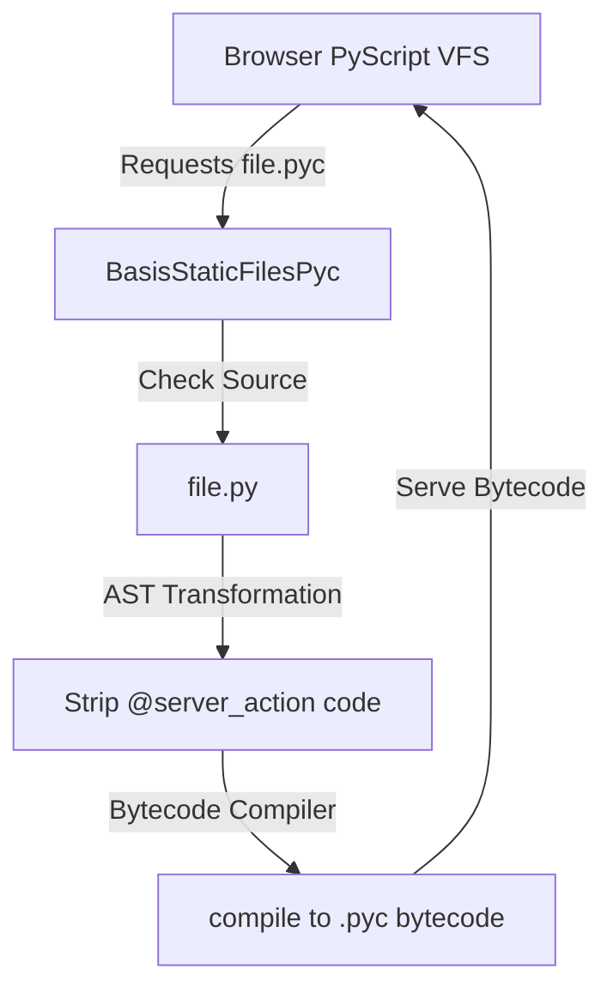

# PYC Bytecode Delivery Mode

**PYC Mode** is a high-performance feature in Basis that compiles Python source files into `.pyc` bytecode on-the-fly and serves bytecode directly to the browser's PyScript / Pyodide Virtual File System (VFS).

---

## Why Use PYC Mode?

When PyScript runs in the browser, downloading and parsing raw `.py` source files requires the Pyodide WebAssembly runtime to compile the source code into Python bytecode before execution. 

PYC Mode addresses this by performing bytecode compilation on the server:

1. **Faster Client Startup**: Browser skips bytecode compilation during PyScript initialization.
2. **Security & Privacy**: Server-side logic inside `@server_action` methods is automatically stripped out before compiling code for the browser.
3. **Reduced Memory Footprint**: Compact `.pyc` bytecode reduces Pyodide memory allocation during boot.

---

## Enabling PYC Mode

### 1. Via the Basis CLI
Pass the `--pyc` flag when starting the development server:

```bash
basis dev --pyc
```

### 2. In Python Code
Pass `pyc_mode=True` when initializing the `Basis` application:

```python
from basis import Basis

app = Basis(pyc_mode=True)
```

### 3. Via Environment Variable
Set `BASIS_PYC_MODE=1` in your environment:

```bash
export BASIS_PYC_MODE=1
basis dev
```

---

## How It Works



### 1. `BasisStaticFilesPyc` Handler
When PYC Mode is active, Basis swaps standard Starlette `StaticFiles` handlers with `BasisStaticFilesPyc`. When PyScript requests a file (e.g. `/basis/shared/component.pyc` or `/components/counter.pyc`), the handler dynamically locates the corresponding `.py` file.

### 2. Server Action Code Stripping
Before compiling the Python file into bytecode for the client, Basis parses the module's AST and strips out the execution body of any functions decorated with `@server_action`.

#### On Server:
```python
@server_action
async def update_balance(self, user_id: int, amount: float):
    # Secret DB query & API call
    user = await db.get_user(user_id)
    user.balance += amount
    await db.save(user)
    return user.balance
```

#### Bytecode Delivered to Browser:
The browser receives bytecode containing an empty function shell, preserving function signatures for RPC proxy creation without exposing server secrets or backend imports.

### 3. Version Safety & Graceful Fallback
Python bytecode includes a 4-byte **Magic Number** indicating the exact Python compiler version (e.g., Python 3.11 vs 3.12). 

- `BasisStaticFilesPyc` checks that the server's Python runtime version is compatible with Pyodide's Python version.
- If a version mismatch occurs (or if bytecode generation fails), Basis transparently falls back to serving standard `.py` source text, preventing "bad magic number" import crashes in the browser.
