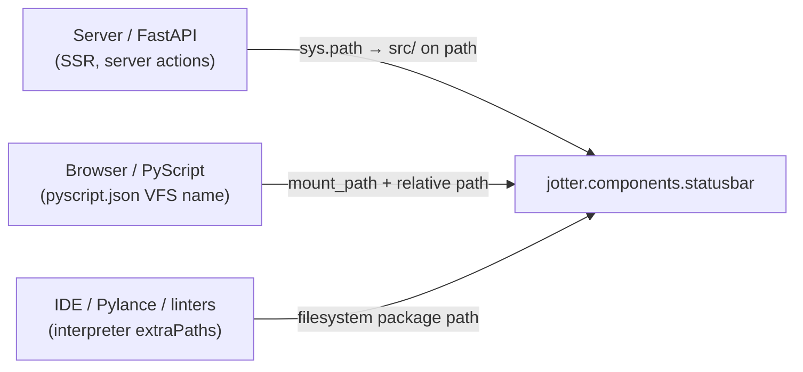

# Importing Components & the Isomorphism Principle

Basis is *isomorphic*: the exact same Python module you write on disk is executed
on the server (SSR, server actions) **and** in the browser (PyScript client).
Because one file must run in both worlds, its **import name must be identical in
every environment** — the server, the browser's virtual file system, and your
IDE's language server. This document explains that invariant, why it matters,
and how Basis keeps it safe automatically.

---

## 1. The three environments

Every `.py` file in a Basis app can be imported in three places, and all three
must resolve to the **same** dotted name:



For `src/jotter/components/statusbar.py`:

- **Server** imports it as `jotter.components.statusbar` (because `src/` is on the
  Python path and `jotter` is a package).
- **Client** imports it as the **VFS name** that Basis derives from the component
  mount path + the file's path inside the mount.
- **IDE** resolves `jotter.components.statusbar` against the interpreter path.

The framework only stays coherent when all three agree. If the client VFS name
differs from the filesystem name, then either the browser can't find the module,
or your IDE flags every import as unresolved — both are "it works in one world,
broken in another" bugs that are miserable to debug.

---

## 2. The invariant

> **The VFS import name MUST equal the filesystem import name.**

The VFS name is derived from the **mount path**. So the rule becomes concrete:

> **A component directory's mount path MUST reproduce its filesystem package
> path.**

That is why Jotter's components live in `src/jotter/components/` and are mounted
at `/jotter/components/` — the mount path *is* the package path written with
slashes instead of dots, so the VFS name `jotter.components.statusbar` is
identical to the filesystem name.

Components reference each other by those filesystem names today:

```python
# app_container.py
from jotter.components.titlebar import TitleBar
from jotter.components.statusbar import StatusBar
```

This works on the server, in the browser, and in the IDE *because* the mount
path preserves the namespace. This is not incidental — it is the load-bearing
invariant of the framework.

---

## 3. Conventional directories are auto-discovered

Basis defines a convention for the standard subdirectories of an app package.
When you create `app = Basis()` and bootstrap it, Basis looks in the **app
directory** (the folder containing the module that created the `Basis`
instance) for:

| Directory    | Auto-discovery behavior                                                        |
|--------------|--------------------------------------------------------------------------------|
| `components/` | Mounted at `/pkg/components/`; every `.py/.html/.css` is served to the client and registered in `pyscript.json`. |
| `stores/`    | Mounted at `/pkg/stores/` **and** every `.py` module is imported so its module-scope store instances register. |
| `plugins/`   | Each `.py`/package exposing a `plugin` variable is registered as a plugin.      |

The mount path is **derived from the package path**, never hard-coded, so the
invariant holds by construction:

```
src/jotter/components/   →  package "jotter.components"   →  mount "/jotter/components/"
src/jotter/stores/       →  package "jotter.stores"       →  mount "/jotter/stores/"
```

### The `__init__.py` requirement

A conventional directory is only auto-discovered if it is a **real Python
package** — it contains an `__init__.py` (even an empty one). Basis intentionally
does **not** silently invent a VFS-only namespace for a bare folder: that would
break the invariant (the client could import `components.statusbar`, but neither
the server nor your IDE would find it). If a conventional directory has no
`__init__.py`, Basis skips it and prints a warning telling you to add one.

> **Why a regular package and not a namespace package?** A regular package
> (`__init__.py` present) is resolved reliably by every IDE, linter, and
> toolchain. Namespace packages (no `__init__.py`) work at runtime but are
> resolved inconsistently by tooling. Requiring `__init__.py` keeps the
> isomorphism simple *and* IDE-friendly.

### Existing mounts win

If you call `include_components_dir()` yourself for a path that auto-discovery
would produce, your explicit mount is kept and discovery skips it. Explicit
configuration always overrides convention.

---

## 4. Stores follow the same convention

The `stores/` directory uses the same discovery, and adds one extra rule: each
store is **instantiated at module scope** so its blueprint registers:

```python
# stores/state.py
from basis.shared.store import Store

class AppState(Store):
    theme = "dark"

app_state = AppState("app_state")   # module-scope instance → registers the blueprint
```

Instantiating at module scope registers the store's persistent **blueprint**
(name → class + constructor config), which is what lets:

- `Page.stores` resolve stores **by name** (`stores = ["app_state", ...]`), or
- a page with no `stores` default to **all auto-discovered stores**, and
- SSR / server actions rebuild the proper subclass via `Store.resolve(name)`.

The client receives the list of store modules via a `#basis-store-imports` script
and imports them on boot, so the same instances exist in the browser and hydrate
from `#basis-initial-state`.

```python
from basis.shared.page import Page
from jotter.components.app_container import AppContainer

class HomePage(Page):
    root_component = AppContainer
    # stores: unset → all auto-discovered stores (app_state, router, theme, …)
```

See [Stores & State](../05_reactivity/stores.md) for the full story.

---

## 5. `@app.page` is isomorphism-aware

When you decorate a root component with `@app.page`, Basis checks whether the
component's file already lives inside a discovered directory:

- **Yes** (e.g. it's in `components/`) → the component is served from the
  discovered, isomorphic mount (`/pkg/components/my_page.py`) and **no** legacy
  `/` mount is added. The import name stays `pkg.components.my_page`.
- **No** (a bare single-file app, e.g. `app.py` at the project root) → Basis
  falls back to mounting the app directory at `/`, which *is* isomorphic for a
  component at the app root (`app` on disk ↔ `app` in the VFS).

This removes the old behavior where `@app.page` always mounted `/`, which created
a second, non-isomorphic namespace the moment a component lived in a subpackage.

---

## 6. The isomorphism guard

Basis enforces the invariant at startup. When the PyScript VFS is built, every
VFS module name is compared against the server import name; any mismatch logs a
loud warning:

```
⚠️  Isomorphism violation: VFS module 'components.statusbar' maps to server
    module 'jotter.components.statusbar'. Component mount paths must reproduce
    the filesystem package path so client VFS, server and IDEs resolve the same
    import names.
```

If you ever see this warning, a mount path diverges from its package path — fix
the mount (or the directory layout) before anything else. Plugins that serve
components get the same check on their `static_mount`.

---

## 7. Layout guidance

The blessed layout — produced by `basis init` — is a `src/` package layout:

```text
my_project/
├── pyproject.toml
└── src/
    └── my_app/
        ├── __init__.py          # app = Basis(); app.bootstrap()
        ├── components/          # auto-discovered, mounted at /my_app/components/
        │   ├── __init__.py
        │   └── statusbar.py
        ├── stores/              # auto-discovered, mounted at /my_app/stores/
        │   ├── __init__.py
        │   └── state.py
        ├── plugins/             # auto-discovered plugins
        │   └── __init__.py
        └── static/
```

For a flat (non-`src/`) layout, the same rules apply: each conventional
directory must be a real package, and the project root must be on the Python
path (so `my_app.components.x` is importable server-side). When in doubt, use
the `src/` layout that `basis init` generates.

---

## 8. What NOT to do

- **Don't** mount a directory at a path that doesn't match its package path
  (e.g. `include_components_dir("/components", "src/jotter/components")`). The
  guard will warn, and imports will break in at least one environment.
- **Don't** rely on import-rewriting at serve time to bridge two namespaces.
  Code on disk that doesn't match the code executed is exactly the 
  IDE-hostile, hard-to-debug state this principle exists to prevent.
- **Don't** drop a bare `components/` folder without `__init__.py` and expect
  discovery to "just figure it out". Add the (empty) `__init__.py`.

Keep the invariant — *VFS name == filesystem name* — and your components will
run identically on the server, in the browser, and in your IDE.
