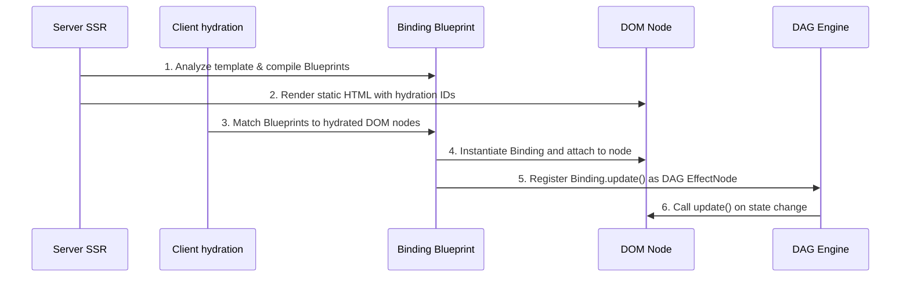

# The Binding Engine

Basis compiles component templates into **Binding** instances. Each Binding connects a specific piece of reactive state to a specific DOM node. When state changes, only the bindings that depend on that state run their `update()` method — the rest of the DOM is untouched.

This is the core difference from Virtual DOM frameworks, which re-evaluate the entire component tree and diff it against the previous version.

---

## Binding types

The framework defines various specialized binding classes, each handling a distinct type of DOM relationship.

### `SelfBinding`

Links a component instance to its root element in the DOM. Stores the reference on the DOM element as `element.__basis_instance__ = self`, which allows parent components and the hydration engine to locate component boundaries.

### `TextBinding`

Manages dynamic text inside standard DOM text nodes.

- **Template**: `
Score: {points}
`
- Basis splits the text node, isolates the `{points}` segment as its own text node, and updates `.textContent` directly when `points` changes.

### `AttributeBinding`

Manages dynamic HTML attributes.

- **Template**: `
`
- Calls `element.setAttribute()` with the re-evaluated attribute string when any dependency changes.

### `TextContentAttributeBinding`

Handles the `text-content` special attribute, which sets an element's text content from a reactive expression.

- **Template**: ``

### `IfBinding`

Controls conditional rendering.

- **Template**: `
Welcome back!
`
- When the condition is false, the element is removed from the DOM and replaced with a comment placeholder. When true, it's restored in place.

### `SelfAttributeBinding`

Maps attributes passed on a child component's tag to the child instance's state.

- **Template**: `<user-profile age="28" status="{user_status}"></user-profile>`
- Updates the child component's `age` and `status` state nodes when the parent's values change.

### `ModelBinding`

Two-way binding for form inputs.

- **Template**: `<input bind="{search_query}">`
- Combines a display binding (sets the input's value to `self.search_query`) with an event listener (writes the user's input back to `self.search_query` on `input` or `change` events). Basis selects the correct event type based on the input element type (`input` for text, `change` for checkboxes and selects).

### `EventBinding`

Attaches an event listener that calls a component method.

- **Template**: `<button onclick="{submit_form}">Submit</button>`
- The referenced method is called when the event fires.

### `FormModelBinding`

Provides automatic two-way data binding and validation for entire forms mapped to `SQLModel` or standard Python `dataclasses`.

- **Template**: `<form bind="{user_model}" validate-on="blur">`
- When Basis sees `bind` on a `<form>` element, it instantiates `FormModelBinding`. This binding:
  1. Scans the form for all nested `<input>`, `<select>`, and `<textarea>` elements with a `name` attribute.
  2. Automatically maps user inputs to fields on the target model.
  3. Intercepts `submit`, `input`, and `blur` events to run the framework's internal `validate_model()` function.
  4. Automatically populates a reactive dictionary named `{model}_errors` with any Pydantic/SQLModel validation errors, which you can bind directly in your template for error messages.

### `ChildBinding`

Handles child component instantiation. When Basis encounters a hyphenated tag (e.g. `<user-card>`) in a template, it looks up the registered component class, mounts a new instance, and attaches it.

### `LoopBinding`

High-performance loop binding using a Longest Increasing Subsequence (LIS) diffing algorithm to reconcile list items in-place. Supports optional `key` tracking by identity and falls back to index-based tracking when omitted.

- **Unkeyed Template**: `<li for="todo" in="{todos}">{todo}</li>`
- **Keyed Template**: `<li for="user" in="{users}" key="id">{user.name}</li>`

**Why `key` matters:**
If you don't provide a `key`, Basis updates DOM nodes based on their index in the list. If you reverse a list, the DOM nodes stay exactly where they are, and Basis just overwrites the text content of every node to match the new reversed order. 

If you *do* provide a `key`, Basis tracks the identity of the underlying data item. If you reverse a keyed list, Basis actually moves the existing DOM nodes to their new positions. This preserves input focus, CSS transition state, and scroll position within the moved elements.

### `SlotBinding`

Reserves a zone in a child component's template for content projected from the parent. See [Parent & Child Components](../04_components/child-components.md) for usage.

---

## The binding lifecycle

Blueprints are class-level objects compiled once at class definition time. When a component is instantiated (or hydrated from SSR), each Blueprint is used to create a live Binding attached to the appropriate DOM node. The Binding's `update()` method is then registered as an `EffectNode` in the DAG — so subsequent state changes flow through the graph and call only the affected `update()` methods.
