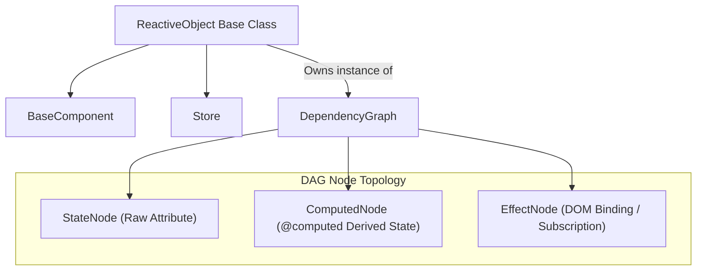

# The DAG Reactivity Engine

Basis uses a **Directed Acyclic Graph (DAG)** to track state propagation. Both `BaseComponent` and `Store` inherit from a unified base class named `ReactiveObject`, equipping all components and global state stores with fine-grained reactivity.

When you mutate an attribute, the DAG propagates the change exclusively to computed properties and DOM bindings dependent on that attribute. There is no Virtual DOM, no full re-render, and no dirty-checking loop.

---

## The Unified Architecture (`ReactiveObject`)



---

## The Three Node Types

### 1. `StateNode`
Represents root state sources (raw instance attributes). They hold raw state values and notify dependents when values are assigned or modified.

### 2. `ComputedNode`
Represents derived values created with the `@computed` decorator (and, per loop item, the `@derived` decorator). A computed node is **lazy** and **memoized**: its body runs on first access and re-runs only when an upstream dependency is marked stale. Its dependencies are discovered by **execution tracking** — whatever reactive attributes the body actually reads when it runs — so they can reach through helper methods, `getattr`, other objects, and other stores/components.

### 3. `EffectNode`
Represents terminal side-effects. In components, DOM bindings (Text, Attribute, Model, Loop) register as effect nodes. In stores, subscription notifications register as effect nodes. Effect nodes are the leaves of the DAG and have no downstream dependents.

---

## `@computed` — Execution-Tracked Derived State

The `@computed` decorator defines properties derived from state. Dependencies are discovered by **execution tracking**, not by parsing your source: when the body runs, every reactive attribute it reads — even through helper methods, `getattr`, dotted chains, or *another* `ReactiveObject` — becomes a real DAG edge:

```python
from basis.shared.reactive import computed
from basis.shared.component import Component

class Cart(Component):
    items = [{"price": 10}, {"price": 20}]
    tax_rate = 0.1

    def _prices(self):
        return [item["price"] for item in self.items]

    @computed
    def subtotal(self):
        return sum(self._prices())   # helper indirection is still tracked

    @computed
    def tax(self):
        return self.subtotal * self.tax_rate
```

`subtotal` depends on `items` even though the read happens inside `_prices()`; `tax` depends on the `subtotal` computed node and `tax_rate`.

### Lazy, memoized, cycle-safe
- **Lazy** — the body runs on first access, not at mount, so reading an attribute that has no value yet does not abort mounting.
- **Memoized** — the body runs at most once per dependency change; unchanged reads return the cached value.
- **Cycle-safe** — a circular dependency raises `RecursionError` (`A → B → A`).

### Manual dependency overrides
If a dependency exists that the body does not read directly — e.g. a `$store.attr` relay — supply it explicitly. Declared dependencies are re-attached on every update:

```python
@computed(dependencies=["items", "discount_rate"])
def final_price(self):
    ...
```

### Empty-dependency warning
A `@computed` that computes with **no** reactive dependencies can never recompute; Basis prints a `Basis Reactivity Warning` once in that case.

### What does NOT count as a dependency
- **In-place container mutation** (`self.items.append(...)`) does not trigger the DAG — reassign the attribute, or call `react([...])`.
- **`_`-private reads** are intentionally untracked (framework internals).
- Reads of plain non-reactive objects are not reactive; only the *reference* to them is tracked.

---

## Cross-Store and Cross-Component Dependencies

Because reads are tracked at runtime and stale effects flush through a shared queue, a computed can depend on state in **another store or component** directly — no string plumbing:

```python
from basis.shared.store import Store
from basis.shared.reactive import computed

prices = Store("prices")
prices.rates = {"apple": 1.5, "banana": 0.5}

class Cart(Store):
    items = [{"name": "apple", "qty": 2}]

    @computed
    def total(self):
        # Reads the 'prices' store's StateNode across objects.
        return sum(prices.rates[i["name"]] * i["qty"] for i in self.items)

cart = Cart("cart")
```

Change `prices.rates` (or `cart.items`) and `total` recomputes; every binding or subscription on `$cart.total` updates. A component computed can likewise read a store or another component's attribute by reference. Template-level `{$store.x}` / `{#comp.x}` bindings are the ergonomic sugar on top of these edges.

For per-loop-item derived values — one memoized node per loop item, recomputed on item reuse or owner-state change — see the `@derived` decorator in [Loop Bindings](loop-bindings.md).

---

## State Mutation Lifecycle

When `self.count += 1` is executed:

1. `ReactiveObject.__setattr__` intercepts the assignment, compares identity/value changes, and invokes `self._dag.trigger("count")`.
2. The DAG marks `count`'s `StateNode` as stale and recursively marks downstream `ComputedNode` and `EffectNode` dependents as stale.
3. `process_updates()` flushes the **shared stale-effect queue** — effects marked stale on any object's graph (cross-object edges land here) — and triggers their update callbacks.
4. If an `EffectNode` depends on a `ComputedNode`, the computed node recalculates its cached value (lazily, on read) before the effect updates the DOM.

---

## Batching Mutations with `refrain()`

To avoid redundant DOM updates during multi-property updates, use `refrain()`:

```python
with self.refrain() as refrained:
    refrained.first_name = "John"
    refrained.last_name = "Doe"
    refrained.age = 30
```

Assignments inside the `with` context block are stored in a temporary buffer. When exiting the block, the DAG triggers a single batch update (`trigger_batch`), executing DOM effects exactly once.
