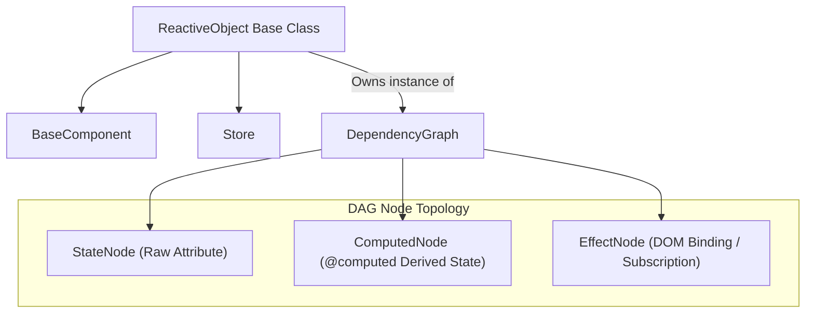

# The DAG Reactivity Engine

Basis uses a **Directed Acyclic Graph (DAG)** to track state propagation. Both `BaseComponent` and `Store` inherit from a unified base class named `ReactiveObject`, equipping all components and global state stores with fine-grained reactivity.

When you mutate an attribute, the DAG propagates the change exclusively to computed properties and DOM bindings dependent on that attribute. There is no Virtual DOM, no full re-render, and no dirty-checking loop.

---

## The Unified Architecture (`ReactiveObject`)



---

## The Three Node Types

### 1. `StateNode`
Represents root state sources (raw instance attributes). They hold raw state values and notify dependents when values are assigned or modified.

### 2. `ComputedNode`
Represents derived values created with the `@computed` decorator. It caches calculation results and re-evaluates only when one of its upstream dependency nodes is marked stale. Computed nodes can depend on other computed nodes or state nodes across stores and components.

### 3. `EffectNode`
Represents terminal side-effects. In components, DOM bindings (Text, Attribute, Model, Loop) register as effect nodes. In stores, subscription notifications register as effect nodes. Effect nodes are the leaves of the DAG and have no downstream dependents.

---

## `@computed` Properties & AST Dependency Extraction

The `@computed` decorator defines properties derived from state. Basis parses the function's Abstract Syntax Tree (AST) using Python's built-in `ast` module to automatically detect `self.x` attribute dependencies:

```python
from basis.shared.reactive import computed
from basis.shared.component import Component

class Cart(Component):
    items = [{"price": 10}, {"price": 20}]
    tax_rate = 0.1

    @computed
    def subtotal(self):
        return sum(item["price"] for item in self.items)

    @computed
    def tax(self):
        return self.subtotal * self.tax_rate
```

### Manual Dependency Overrides
If an AST analysis cannot infer dynamic dependencies (e.g. indirect dictionary lookups), explicit dependency names can be supplied:

```python
@computed(dependencies=["items", "discount_rate"])
def final_price(self):
    ...
```

---

## State Mutation Lifecycle

When `self.count += 1` is executed:

1. `ReactiveObject.__setattr__` intercepts the assignment, compares identity/value changes, and invokes `self._dag.trigger("count")`.
2. The DAG marks `count`'s `StateNode` as stale and recursively marks downstream `ComputedNode` and `EffectNode` dependents as stale.
3. `DependencyGraph.process_updates()` iterates through stale `EffectNode` instances and triggers their update callbacks.
4. If an `EffectNode` depends on a `ComputedNode`, the computed node recalculates its cached value before the effect updates the DOM.

---

## Batching Mutations with `refrain()`

To avoid redundant DOM updates during multi-property updates, use `refrain()`:

```python
with self.refrain() as refrained:
    refrained.first_name = "John"
    refrained.last_name = "Doe"
    refrained.age = 30
```

Assignments inside the `with` context block are stored in a temporary buffer. When exiting the block, the DAG triggers a single batch update (`trigger_batch`), executing DOM effects exactly once.
