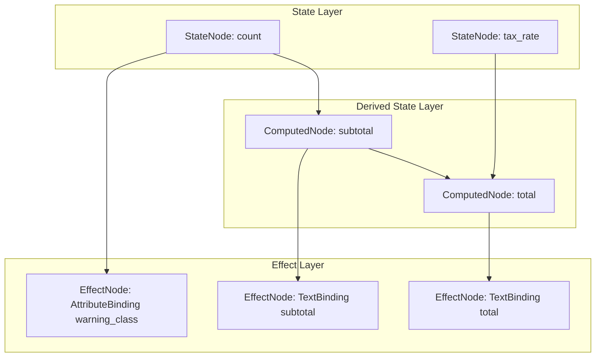

# The DAG Reactivity Engine

Basis uses a **Directed Acyclic Graph (DAG)** to track how state flows through your components. Each component instance owns a `DependencyGraph` object. When you mutate an attribute, the graph propagates the change to every computed value and DOM binding that depends on it — nothing more.

There is no Virtual DOM, no full component re-render, and no dirty-checking scan.

---

## The three node types



**`StateNode`** — A raw component attribute (e.g. `count = 0`). These are the sources of state. They're never stale; they just hold a value and notify dependents when that value changes.

**`ComputedNode`** — A derived value defined with `@computed`. It caches its result and only recalculates when one of its upstream `StateNode`s is marked stale. Computed nodes can depend on other computed nodes.

**`EffectNode`** — A terminal node that performs a side effect, typically updating a DOM node. Bindings register themselves as effect nodes. They have no descendants — they're the leaves of the graph.

---

## Computed properties

The `@computed` decorator defines a property whose value is derived from other state. Basis automatically detects which state variables the function reads by parsing its source code with Python's `ast` module:

```python
from basis.shared.dag import computed
from basis.shared.component import Component

class Cart(Component):
    items = [{"price": 10}, {"price": 20}]
    tax_rate = 0.1

    @computed
    def subtotal(self):
        return sum(item["price"] for item in self.items)

    @computed
    def tax(self):
        return self.subtotal * self.tax_rate
```

Basis parses each `@computed` method's source, finds all `self.x` attribute accesses, and registers those as dependencies in the graph. `subtotal` depends on `items`; `tax` depends on `subtotal` and `tax_rate`.

If the AST analysis can't pick up a dependency (e.g. the value comes from a dynamic lookup), you can declare dependencies explicitly:

```python
@computed(dependencies=["items", "discount_rate"])
def final_price(self):
    # dependencies explicitly declared, AST analysis skipped
    ...
```

---

## How a state mutation propagates

When you write `self.count += 1`:

1. `BaseComponent.__setattr__` intercepts the assignment, compares the new value to the old one, and calls `self._dag.trigger("count")`.
2. The DAG marks `count`'s `StateNode` stale, then walks its dependents and marks them stale recursively.
3. `DependencyGraph.process_updates()` iterates all `EffectNode`s and calls `update()` on any that are stale.
4. Each stale `EffectNode` first ensures its upstream `ComputedNode`s are up to date, then runs its DOM update function.

Only nodes reachable from `count` in the dependency graph are touched.

---

## Batching mutations with `refrain()`

Mutating several attributes one after another would trigger the DAG — and therefore DOM updates — after each individual assignment. For cases where you want to apply multiple changes atomically, use the `refrain()` context manager:

```python
with self.refrain() as refrained:
    refrained.first_name = "John"
    refrained.last_name = "Doe"
    refrained.age = 30
# DOM updates happen once, here
```

All assignments inside the `with` block are queued. The DAG runs a single batch update when the block exits, so the DOM is touched exactly once regardless of how many attributes changed.
