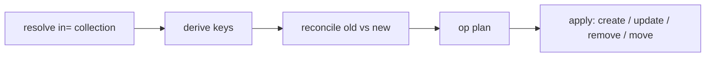

# Loop Bindings

A `for`/`in` template attribute compiles to a single **`LoopBinding`**. Instead of re-rendering the whole component when a list changes, the loop **reconciles the existing DOM in place** — creating, updating, removing, and moving only the item nodes that actually need it.

```html
<ul>
    <li for="todo" in="{todos}">{todo}</li>
</ul>
```

---

## The mental model

A loop is **one binding, one template, per-item instances**:

- `for="item" in="{expr}"` — `item` is the **loop variable**; `{expr}` is a real collection expression (a component field, `{$store.list}`, `{data['list']}`, or — in a nested loop — `{grp['items']}`), evaluated against the owner and any enclosing loop scopes.
- Each item renders into a thin **`LoopItem`** — a wrapper node plus its body bindings — **not** a full component. There is no per-item DAG, lifecycle, or subscription.
- Loop-body bindings are bound to the **owner** (the component that wrote the template) and resolve against a per-item **scope overlay** for the loop variable. Events run on the owner, and parent state read inside the loop stays live.
- **`key`** is optional: it tells the loop which identity to track so items can be *moved* instead of re-created.

This is the same reconciliation model as Vue's `v-for`/`:key`, React's `key`, and Svelte's `{#each key}`.

---

## The pipeline



1. **Resolve** — evaluate the `in=` expression against the owner + enclosing loop scopes. Failures yield an empty collection (never an error rendered into the loop).
2. **Derive keys** — with `key`, read that field off each item (dicts via `item[key]`, objects via `item.key`); if the field is absent on a non-dict item, fall back to the item *itself* (so scalar items like ints get distinct keys); unhashable keys fall back to their position. Without `key`, keys are the positional indices `0, 1, 2, …`.
3. **Reconcile** — compare the previous item keys against the new collection keys and produce an op plan:
   - `remove` — keys no longer present;
   - `create` / `update` — new keys are created, reused keys are updated, in the new order;
   - `move` — reused keys that are **not** part of the Longest Increasing Subsequence (LIS) stable run are moved, so reorders take the fewest DOM moves.
4. **Apply** — the `LoopBinding` executor acts on the plan: `create` clones the template and builds the body; `update` refreshes the item overlay and re-renders the body (or pushes new props to a custom-element child); `move` re-inserts the node; `remove` disposes and drops it.

The diff is **pure** — no DOM — so the decision logic is unit-testable and identical on the server and client.

---

## Keyed vs unkeyed

| | Unkeyed | Keyed |
|---|---|---|
| Template | `<li for="todo" in="{todos}">{todo}</li>` | `<li for="user" in="{users}" key="id">{user.name}</li>` |
| Key source | positional index | the item's `key` field (or the item itself for scalars) |
| Reversed list | nodes reused **in place**, text re-rendered | existing nodes **moved** to their new positions |
| State preserved on reorder | no | yes — focus, scroll, transition state |

Use a **`key`** whenever the list can reorder, items are filtered, or an item holds local state you want to keep (a text input's focus, an open accordion, a CSS transition). Without a key, items are matched purely by position.

Scalar collections get distinct keys automatically: `key="y"` over `[10, 20]` keys the items as `10` and `20` (Svelte `(item)`-style), so they never collapse onto a single `None` key.

---

## Per-item scope & live parent fields

Inside the loop body the loop variable resolves through a per-item scope and **shadows** any same-named owner field (the Vue/Svelte rule). Every other name resolves against the **owner's live scope**.

Because body bindings are owner-bound and register their owner-dependencies on the owner's DAG, a parent field read in a loop body updates **live** even when the collection itself does not change:

```html
<div for="it" in="{items}" key="k" class="item {mode}">{it['n']}</div>
```

Toggling `mode` re-renders every item's class without touching the list. See [Scoping in Loops](../04_components/loop-scope.md) for the full ownership model and its footguns.

---

## Item index (`index="<attr>"`)

By default a loop only exposes the **item** through its loop variable — there is no built-in `$index`. When you need the item's positional position inside the body, add `index="<name>"` and the framework stamps that attribute/key onto **each item** on every reconcile, so it is readable in the body:

```html
<div for="it" in="{items}" index="_index">{it['_index']} — {it['n']}</div>
```

- **Dict items** get a key: `it['_index']` → `0`, `1`, `2`, …
- **Object items** get an attribute: `it._index` → `0`, `1`, …
- **Immutable scalars** (int, str) can't hold attributes and are skipped silently.

The index is the **positional** position and is re-stamped on every reconcile, so it stays correct after inserts/removes/reorders (it is *not* the reconciliation key — that only coincides with the index in keyless loops). The attribute is **opt-in**: without `index=`, items are never mutated, so a real data field named `_index` can't be clobbered.

---

## Nested loops

A `for` inside another loop's body is a nested loop. Its `in=` and body resolve against the chain `{inner_item, outer_item, owner}`, and reusing an outer item re-runs the inner loop:

```html
<div for="grp" in="{groups}" key="g">
    <span>{grp['g']}:</span>
    <div for="it" in="{grp['items']}" key="name">{it['name']}</div>
</div>
```

---

## Custom-element loop children

A hyphenated tag in a loop mounts a **real child component** per item. Per-item data flows through attributes (formatted against the item), never through slot content:

```html
<ui-text for="it" in="{items}" key="n" label="{it['n']}"></ui-text>
```

Each child keeps its own component instance and event handlers. (Slot content inside a loop is not bound — see footgun #2 in [Scoping in Loops](../04_components/loop-scope.md).)

---

## Identity & ordering guarantees

- A reused key keeps the **same** `LoopItem`, DOM node, and per-item scope — its state survives reconciliation.
- Every item node carries a **`data-item-key`** attribute (the reconciliation key), which is also what SSR hydration uses to match items.
- Reorders are applied with the **LIS stable subsequence**, so only the nodes that actually changed position move.

---

## SSR hydration

On `/ssr` the loop re-points its item wrappers and body bindings to the live SSR tree by `data-item-key` + relative canonical paths (`shared/hydration.repoint_loop_to_ssr`), recursing into nested loops and keeping custom-element children on their live wrappers — so loop bodies are fully reactive after hydration, not just rendered. See [SSR & Client Hydration](ssr-hydration.md).

---

## Architecture (for framework contributors)

The loop feature is split so the decision logic stays DOM-free:

- **`shared/loop.py`** — the engine:
  - `Reconciler.diff(old_keys, new_keys)` — the pure op-plan diff (`remove` / `create` / `update` / `move`);
  - `derive_keys(collection, key)` — key derivation (incl. scalar fallback);
  - `LoopBodyBuilder` — per-item body construction (clone, owner-bound bindings, per-item scope, owner-DAG effects);
  - `LoopItem` — the thin per-item holder;
  - `get_lis_indices` — the LIS helper.
- **`shared/bindings.py`** — `LoopBinding`, a thin **executor**: resolve → derive keys → `Reconciler.diff` → apply ops to the DOM (including custom-element mounting + `ChildBinding` bookkeeping).
- **`shared/hydration.py`** — `repoint_loop_to_ssr`, the canonical-path SSR matching.

See [Codebase Structure](../08_appendix/codebase-structure.md) for where these live.

---

## Summary

- A loop is **one binding + one template + thin per-item `LoopItem`s** — no per-item components.
- Pipeline: **resolve → derive keys → reconcile → apply** (pure diff, minimal moves).
- **`key`** gives item identity so reorders *move* nodes instead of re-rendering them.
- Body bindings are **owner-bound** with a per-item scope overlay — parent fields stay live.
- Nested loops chain scopes; custom-element children take data via attributes.
- SSR hydration re-points loops by `data-item-key` + canonical paths.
