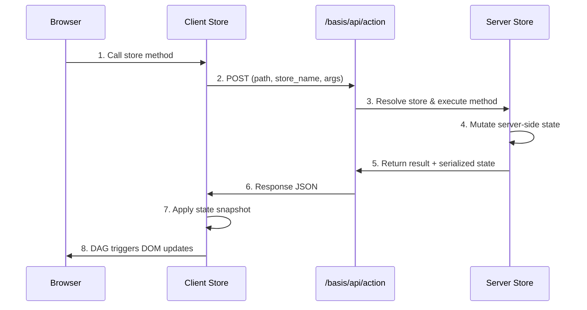

# State Stores & Server Actions

Local component state handles UI concerns — toggle states, form inputs, ephemeral selections. For state that needs to be shared across components, or for operations that need to run on the server, Basis provides **Stores** and **Server Actions**.

---

## Global state stores

A `Store` is a reactive container that any component can subscribe to. When a value in the store changes, every subscribed component updates its relevant DOM nodes automatically.

### Defining a store

```python
from basis.shared.store import Store

class UserSession(Store):
    username = "Guest"
    is_authenticated = False

user_store = UserSession("session")
```

The string passed to the constructor (`"session"`) is the store's registry name. This is what you use to reference it in templates.

### Subscribing in templates

Use the `$store_name.attribute` syntax inside braces to bind to a store value:

```python
class Header(Component):
    """
    <header>
        <div if="{$session.is_authenticated}">
            <span>Welcome, {$session.username}!</span>
            <button onclick="{logout}">Logout</button>
        </div>
        <div if="{not $session.is_authenticated}">
            <button onclick="{login}">Sign In</button>
        </div>
    </header>
    """
    pass
```

The `$session` prefix tells Basis to look up the store registered under the name `"session"` and bind to its `is_authenticated` or `username` attributes respectively.

### Late registration

If a component is defined before the store it depends on is instantiated, Basis queues the subscription. As soon as the store is created, any pending subscriptions for that store name are resolved and the bindings are activated.

---

## Server actions

A `@server_action` is a method decorated to run exclusively on the server. On the client, the decorator replaces the method with an async RPC proxy that serializes the call, sends it to `/basis/api/action`, and applies the server's updated state back to the client store.

### Defining a server action

```python
from basis.shared.store import Store
from basis.shared.actions import server_action

class CartStore(Store):
    items = []

    @server_action
    async def add_item(self, item_name: str, price: float):
        # This runs on the server only.
        # Database access, secrets, and third-party APIs are safe here.
        self.items.append({"name": item_name, "price": price})
        return "Item added."
```

### Calling a server action from a component

Because `@server_action` makes the method async on the client, you must `await` it:

```python
class ProductCard(Component):
    """
    <div class="product">
        <h3>Indigo Sneakers</h3>
        <button onclick="{add_sneakers}">Add to Cart</button>
    </div>
    """

    async def add_sneakers(self):
        result = await cart_store.add_item("Indigo Sneakers", 89.99)
        print(result)
```

The store reference (`cart_store`) is the global Python object. Calling methods on it directly is how you trigger server actions — there is no special syntax inside the component itself.

---

## Server action lifecycle



The complete flow:

1. The browser calls the store method. The RPC proxy intercepts it and POSTs the call to the server.
2. The server locates the registered action function and the target store instance.
3. The action runs on the server with full access to databases and environment variables.
4. After execution, the server serializes the store's updated state and returns it alongside the function's return value.
5. The client store receives the snapshot, updates its local state, and the DAG propagates changes to every subscribed component.
