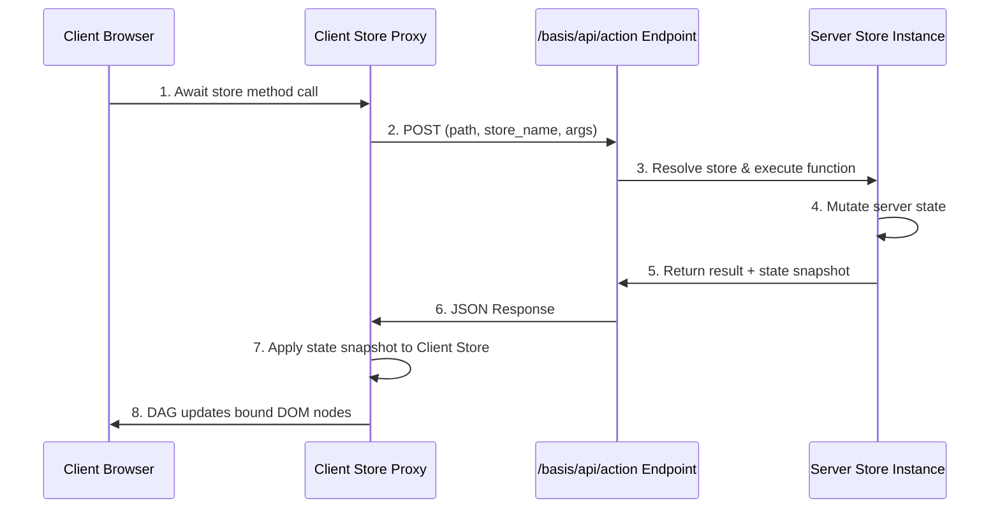

# State Stores & Store Providers

Local component state handles UI concerns like toggle states or form inputs. For shared global state, or data fetched from backend APIs, Basis provides **Stores**, **Store Providers**, and **Server Actions**.

---

## 1. Global State Stores (`Store`)

A `Store` inherits from `ReactiveObject`. Any component can subscribe to a store's attributes. When a store attribute changes, subscribed components update their bound DOM nodes automatically.

```python
from basis.shared.store import Store
from basis.shared.reactive import computed

class UserSession(Store):
    username = "Guest"
    role = "user"
    is_authenticated = False

    @computed
    def is_admin(self):
        return self.is_authenticated and self.role == "admin"

user_store = UserSession("session")
```

The constructor string (`"session"`) registers the store globally under that name for template subscriptions.

### `@computed` on stores (execution-tracked)

A store `@computed` uses the same execution-tracked DAG as components: dependencies are whatever the body reads at runtime (lazy + memoized), and a computed on one store can read another store directly — no string plumbing:

```python
prices = Store("prices")
prices.rates = {"apple": 1.5, "banana": 0.5}

class Cart(Store):
    items = [{"name": "apple", "qty": 2}]

    @computed
    def total(self):
        return sum(prices.rates[i["name"]] * i["qty"] for i in self.items)
```

Change `prices.rates` (or `cart.items`) and `total` recomputes; every `$cart.total` binding or subscription updates. For a manual relay dependency use `@computed(dependencies=["$other_store.attr"])`. See [The DAG Reactivity Engine](dag.md) for the full contract.

---

## 1b. The `stores/` auto-discovery convention

For shared app stores, put them in a `stores/` package inside your app package
(`src/your_app/stores/__init__.py`) and **instantiate each store at module
scope**:

```python
# stores/state.py
from basis.shared.store import Store
from basis.shared.router import RouterStore

class AppState(Store):
    theme = "dark"

app_state = AppState("app_state")   # module-scope instance
router = RouterStore("router")
```

At bootstrap, Basis:

1. **Mounts** `stores/` at its package path (e.g. `/your_app/stores/`) so the
   modules are importable in the browser under the same name as on disk —
   see [Importing Components & the Isomorphism Principle](../04_components/importing-components.md).
2. **Imports** every `.py` module, so the module-scope instances register their
   persistent **blueprints** (name → class + constructor config).
3. Serves the module list to the client under `basis.bootstrap.store_modules`
   in the per-page `/pyscript.json` manifest, which the entrypoint imports on
   boot so the same instances exist in the browser and hydrate from
   `#basis-initial-state`.

Then a `Page` can reference stores **by name**, or leave `stores` empty to
include **all auto-discovered stores**:

```python
class HomePage(Page):
    stores = ["app_state", "router"]   # name-list (subset)
    # or: stores = []  → all auto-discovered stores
```

`Store.resolve(name)` rebuilds a store from its blueprint (preserving subclass
constructor args), which is what SSR and store-bound server actions use.

---

## 2. Subscribing in Component Templates

Use the `$store_name.attribute` syntax inside template braces:

```python
class Header(Component):
    """
    <header>
        <div if="{$session.is_authenticated}">
            <span>Welcome, {$session.username}!</span>
            <span if="{$session.is_admin}">[Admin Panel]</span>
        </div>
    </header>
    """
```

### Late Registration
If a component template references `$session` before `UserSession("session")` is instantiated, Basis queues the subscription. Once the store registers, subscriptions automatically resolve and activate bindings.

---

## 3. Declarative Store Providers

Basis provides declarative components for fetching remote data directly into stores:

### Standard Store Provider (`<store-provider>`)

```html
<store-provider name="products" url="/api/v1/products" target="items"></store-provider>

<ul>
    <li for="p" in="{$products.items}">{p.name} - ${p.price}</li>
</ul>
```

### Model Store Provider (`<model-store-provider>`)

`ModelStoreProvider` integrates with `ModelStore` to perform typed data fetching (and SQLModel server queries):

```html
<model-store-provider name="user_profile" model="{UserModel}" user_id="123" one="true"></model-store-provider>

<div>
    <h3>{$user_profile.name}</h3>
    <p>{$user_profile.email}</p>
</div>
```

Both providers feature **SSR Hydration Guards**: if data was already server-rendered and injected during initial page load, the client provider skips redundant network fetches.

---

## 4. Server Actions (`@server_action`)

A `@server_action` decorator marks a method to execute exclusively on the server. On the client, the decorator replaces the method with an async RPC proxy pointing to `/basis/api/action`.

```python
from basis.shared.store import Store
from basis.shared.actions import server_action

class CartStore(Store):
    items = []

    @server_action
    async def add_item(self, item_name: str, price: float):
        # Executes on the server
        self.items.append({"name": item_name, "price": price})
        return f"Added {item_name}"
```

### Invoking from Components

```python
class ProductCard(Component):
    """
    <button onclick="{add_product}">Add Item</button>
    """
    async def add_product(self):
        msg = await cart_store.add_item("Sneakers", 89.99)
        print(msg)
```

### Server Action Lifecycle Flow


