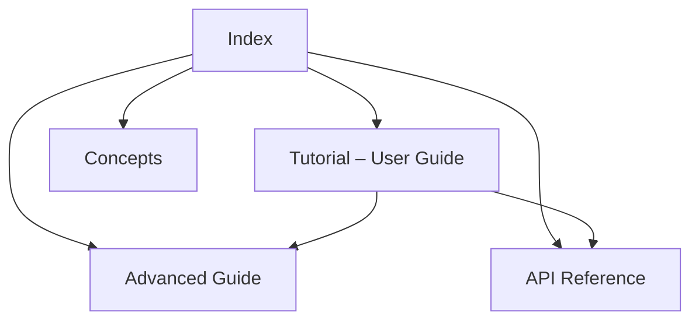

# Basis Framework Documentation

**Basis** is a reactive, full-stack Python framework for building interactive web applications without JavaScript. It uses server-side rendering for the initial page load and PyScript for client-side reactivity, driven by a fine-grained dependency graph that updates only the DOM nodes that actually changed.

```text
  Isomorphic Python Component
 ┌───────────────────────────┐
 │  class Counter(Component) │
 └─────────────┬─────────────┘
               │
      ┌────────┴────────┐
      ▼                 ▼
  [ SERVER ]        [ CLIENT ]
  FastAPI SSR       PyScript hydration
  (Fast, SEO)       (Instant UI updates)
```

---

## Read the docs by track

The documentation is organised into four tracks, so you can read it the way that fits what you are doing right now.

### 🚀 [Tutorial — User Guide](tutorial.md)

Learn Basis by building. A progressive path — from your first reactive app, through components, reactivity, and stores, up to server actions and databases.

### 💡 [Concepts](concepts.md)

Why Basis exists and the design principles behind it — plus the deliberate non-goals and comparisons with other tools.

### 📚 [API Reference](reference.md)

Lookup-oriented documentation: the `Basis` application, the binding and DAG engines, the UI component catalogue, and tooling.

### 🧠 [Advanced Guide](advanced.md)

Deep dives into SSR, client hydration, PYC bytecode delivery, and the plugin system.

---

## New to Basis?

Start with **[Getting Started](getting-started.md)**, then follow the **[Hello World](02_quickstart/hello-world.md)** walkthrough — or run the standalone [`hello.py`](hello.py) example directly.


